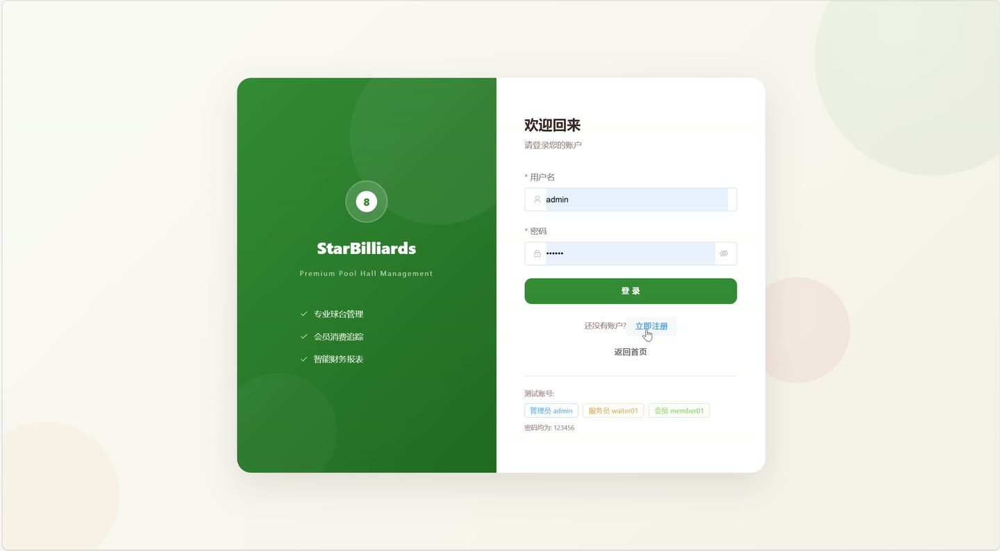
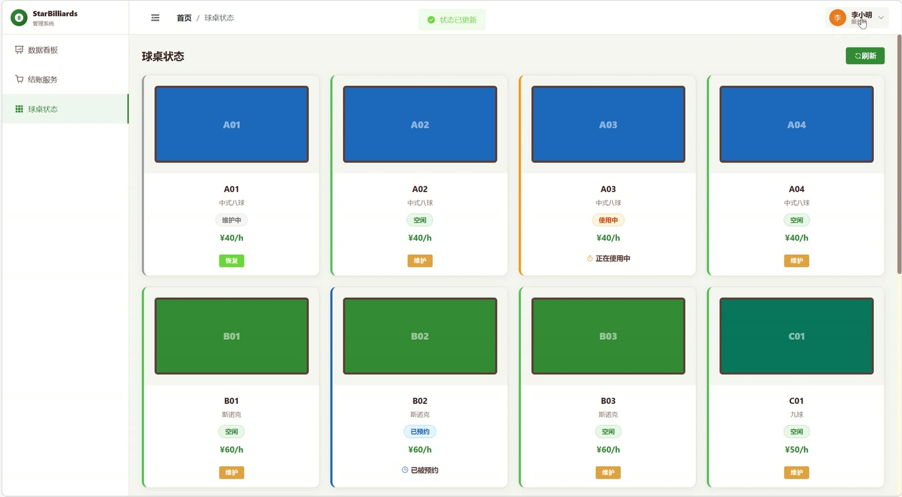
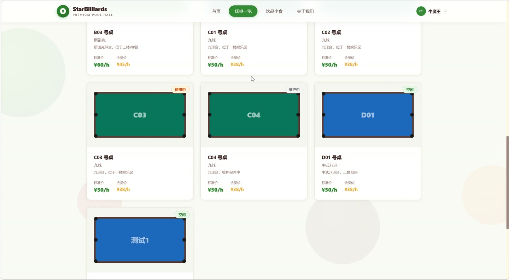
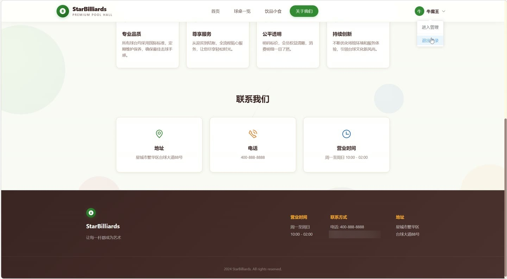

# (附文档)Springboot2+Vue3+MySQL 台球厅管理系统

**技术栈**：Springboot2、Vue3、MySQL

### 系统简介

本系统是一套基于 SpringBoot2 + Vue3 + MySQL 的前后端分离台球厅综合管理平台，覆盖前台展示、会员自助、服务员操作、管理员后台四大应用场景。系统内置 JWT 身份认证与拦截器鉴权，支持球桌计时计费、商品销售、会员储值、预约管理、财务报表导出等核心业务，适用于台球厅数字化运营管理。
 
### 核心功能
 
### 普通用户端

 
- 用户注册：填写用户名、密码、真实姓名、手机号完成注册，密码经 MD5 加密存储，注册成功自动跳转登录页。 
- 用户登录：输入用户名和密码进行登录，校验通过后签发 JWT Token，并返回用户基本信息（密码字段置空）。 
- 首页轮播图：展示启用状态（status=1）的轮播图列表，按 sortOrder 升序排列，支持跳转链接配置。 
- 球桌浏览：查看全部球桌列表（按桌号升序），展示球桌类型、散客价/会员价、当前状态（空闲/使用中/已预约/维护）。 
- 商品选购：按分类浏览上架商品（status=1），展示商品名称、分类、售价、库存、图片及描述。 
- 球桌状态统计：查看球桌总数及空闲、使用中、已预约、维护中的数量分布。 
- 会员余额查询：登录会员可查看个人账户余额及历史充值记录。 
- 会员订单查询：查看个人历史开台订单列表，包含订单号、球桌、台费、商品费、实付金额、支付方式等。 
- 会员预约管理：提交球桌预约申请（选择日期、时间段、球桌），查看预约状态（待确认/已确认/已取消/已完成）。
 
### 服务员端

 
- 球桌状态看板：以卡片形式查看所有球桌实时状态，区分空闲、使用中、已预约、维护四种状态。 
- 开台操作：选择空闲球桌，支持关联会员（可选）和服务员，开台后球桌状态自动变为使用中，生成进行中订单。 
- 订单商品加购：对进行中的订单添加商品，输入商品和数量，自动扣减库存并计算小计金额。 
- 订单商品删除：删除进行中的订单商品项，自动回补库存并重新计算商品费用。 
- 结账操作：选择支付方式（现金/微信/支付宝/余额），可输入优惠金额，系统自动计算台费（按散客价或会员价）、商品费、总金额、实付金额。 
- 余额支付校验：选择余额支付时自动校验会员余额是否充足，扣款成功后同步更新会员余额。 
- 取消订单：对进行中的订单执行取消操作，订单状态变更为已取消，球桌自动释放为空闲。
 
### 管理员端

 
- 仪表盘统计：展示订单总数、今日订单数、累计营业额、今日营业额、会员总数等核心经营指标。 
- 球桌管理：分页查询球桌列表（支持按类型/状态筛选），新增、编辑、删除球桌，配置散客价、会员价、类型、图片、描述。 
- 球桌状态修改：直接切换球桌状态（空闲/使用中/已预约/维护），用于人工干预特殊场景。 
- 商品管理：分页查询商品列表（支持按分类/关键词筛选），新增、编辑、删除商品，维护名称、分类、售价、成本价、库存、上下架状态。 
- 订单管理：分页查询全部订单（支持按状态/订单号/会员/球桌筛选），查看订单详情及商品明细，支持取消进行中的订单。 
- 会员管理：分页查询会员列表（支持按角色/关键词筛选），新增会员、编辑会员资料（姓名/手机号/头像）、删除会员。 
- 会员充值：为指定会员执行充值操作，输入充值金额、赠送金额、支付方式，自动更新余额并生成充值记录。 
- 服务员管理：分页查询服务员账号，新增、编辑、删除服务员，统一管理员工账号信息。 
- 预约管理：分页查询全部预约单（支持按状态/会员筛选），确认预约后球桌状态自动变为已预约，取消或完成后自动释放球桌。 
- 轮播图管理：维护首页轮播图，配置标题、图片、跳转链接、排序号、启用状态，支持新增、编辑、删除。 
- 充值记录查询：分页查看会员充值流水，展示充值金额、赠送金额、余额快照、支付方式、操作员。 
- 财务报表导出：一键导出已结算订单 Excel 报表，包含订单号、球桌、会员、台费、商品费、总金额、优惠、实付、支付方式、时间。
 
### 技术栈

 后端框架SpringBoot 2.x ORM 框架MyBatis-Plus（含分页插件、逻辑删除、字段自动填充） 权限认证JWT（jjwt）+ 自定义拦截器 前端框架Vue 3（Composition API） 状态管理Pinia UI 组件库Element Plus 构建工具Vite 路由管理Vue Router（含路由守卫） 数据库MySQL 8.x Excel 导出Apache POI（XSSFWorkbook） 工具库Hutool（MD5 加密）
 
### 交付内容

 
- 后端完整源码 
- 前端完整源码 
- 数据库初始化脚本 
- 万字文档

## 界面展示

---

## 获取完整源码 + 万字文档

本仓库为项目介绍页。**完整前后端源码、数据库初始化脚本、万字项目文档**，请加微信 `kangkangcode`，或访问 [codekk.top](http://codekk.top) 获取。

可作课程设计 / 毕业设计参考，支持远程部署调试。